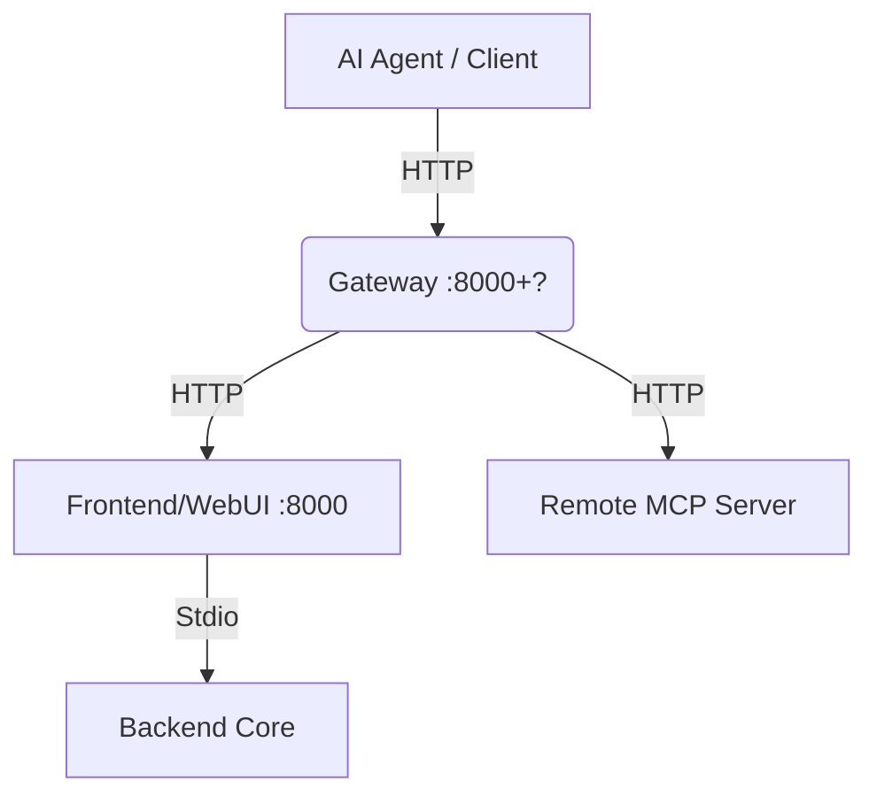

# Gateway Subsystem Design

## Overview
The Gateway Subsystem acts as a centralized aggregator and router. It is designed to sit in front of multiple MCP Servers (or HTTP bridges like the Frontend) and provide a unified API surface for Agents.

## Execution Logic

### 1. Entry Point
- **Script**: `src/server.py`
- **Execution**: Run directly with Python or Uvicorn.

### 2. Initialization Flow
1.  **Logging**: Configures logging to `gateway.log` in the project root.
2.  **Server Registry**: Maintains an in-memory (currently) list of downstream MCP servers.
    -   Format: `{ name, url, token }`.

### 3. Core Mechanisms

-   **Registration**:
    -   `POST /api/gateway/register`: Downstream servers (like the Web UI) can register themselves.
-   **Aggregation**:
    -   `GET /api/tools`: Queries ALL registered servers, fetches their tool lists, and aggregates them with namespaces (e.g., `local-server.read_file`).
-   **Routing**:
    -   `POST /api/tools/execute`: Accepts a namespaced tool name (`server.tool`), looks up the target server, and proxies the execution request to that server's HTTP API.

## Architecture

## Use Case
This subsystem enables a distributed architecture where tools can be spread across different machines or containers (e.g., one container for secure file access, one for browser automation), while the Agent sees a single cohesive toolkit.
